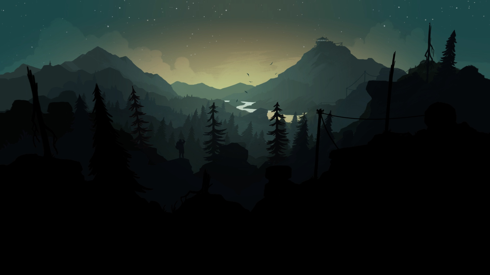

## Hi, I’m Nikita! 

- I'm just a 19 yo student, who dreams of travelling around the world🌎  
- I love learning everything connected with math and IT 💻 
- Goals: more codeforces and more C#/C++ projects🎯 
- I'm looking to collaborate to improve programmming skills together✌ 

---
## Tools:

 

---
## Connect with me:

 

---
## GitHub Activity

        

---

